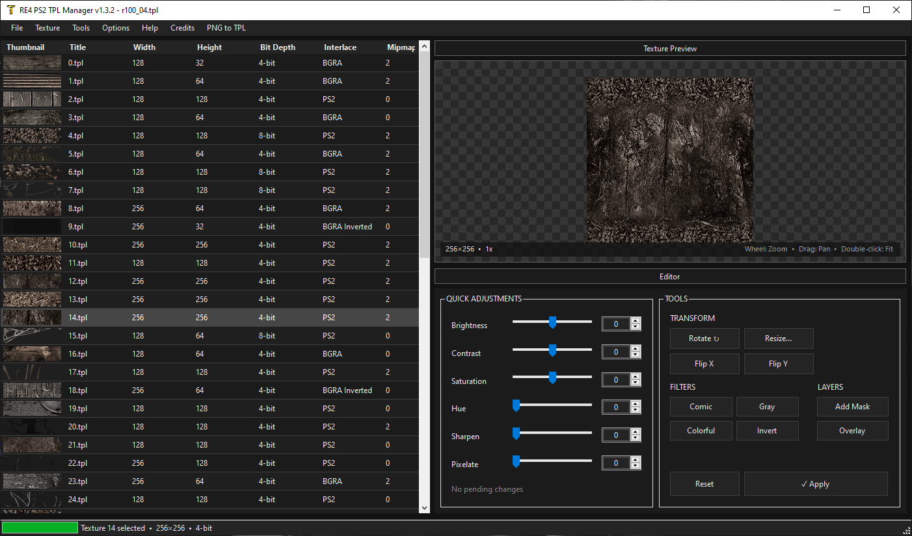

# RE4 PS2 TPL Manager

A texture management tool for **Resident Evil 4 on PlayStation 2**, designed to make working with the game's `.TPL` texture files easier.

> Built primarily for RE4 PS2 modding and research.



## Features

- Open and preview RE4 PS2 `.TPL` files
- Extract individual textures
- Export textures to PNG/BMP/TGA
- Replace textures using PNG images
- Batch replace textures by index
- Batch conversion to **4-bit (16 colors)** or **8-bit (256 colors)**
- Preserve PS2 interlace/swizzle during texture replacement
- Increase or decrease texture color depth
- Alpha/transparency support
- Mipmap support
- Create new empty TPL files
- Extract TPL files from RE4 PS2 SMD/EFF containers
- Automatic backups before destructive operations
- Texture preview with zoom, pan and nearest-neighbor scaling

## Batch Replace

PNG files used for Batch Replace should be named using the **texture index** shown in the TPL Manager.

For example:

```text
0.png
1.png
2.png
25.png
128.png
```

Batch Replace provides three color-depth modes:

- **Preserve TPL color depth** — keeps each destination texture as 4-bit or 8-bit.
- **Force 4-bit** — converts imported textures to 16 colors.
- **Force 8-bit** — converts imported textures to 256 colors.

## Mipmap Viewer

TPL Manager includes a dedicated mipmap viewer for inspecting the different mipmap levels stored in a texture.
Double-clicking a texture in the table will open the mipmap viewer, which allows you to view each mipmap level.

## Getting Started

>.NET Framework 4.7 or later is required to run TPL Manager.

Download the latest release, extract it and run:

```text
RE4_PS2_TPL_Manager.exe
```

Open a `.TPL` file and select a texture from the list to preview or modify it.

For safety, the program automatically creates a `.bak` backup before destructive changes.

This tool does not require installation.

## Contributing

Bug reports, suggestions, and contributions are welcome.

When reporting an issue, including the following information can make troubleshooting much easier:

* What you were trying to do
* What happened
* What you expected to happen
* The texture format involved
* A screenshot, when relevant
* A sample TPL file, if you're able to share it

## Credits

Deinterlace and swizzle algorithms based on **JADERLINK**'s research.

Created for the Resident Evil 4 PS2 modding community.
Resident Evil and Resident Evil 4 are properties of Capcom. This is an unofficial fan-made modding tool and is not affiliated with or endorsed by Capcom.